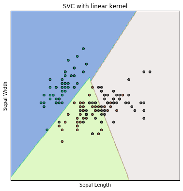
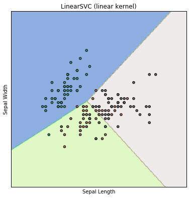
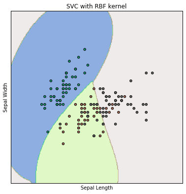
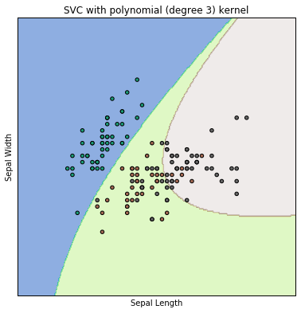

## Support Vector Machines

Here the optimization objective is to maximize the margin, i.e., the distance between the separating hyperplane/decision boundary and the trainig samples that are closest to the hyperplane, i.e., the support vectors.

Decision boundaries with large margins tend to have lower generalization error, while those with small margins are more prone to overfitting


```python
import numpy as np
import matplotlib.pyplot as plt
%matplotlib inline
```


```python
from sklearn import datasets
```


```python
iris = datasets.load_iris()

X = iris.data

Y = iris.target
```


```python
print(iris.DESCR)
```

    Iris Plants Database
    
    Notes
    -----
    Data Set Characteristics:
        :Number of Instances: 150 (50 in each of three classes)
        :Number of Attributes: 4 numeric, predictive attributes and the class
        :Attribute Information:
            - sepal length in cm
            - sepal width in cm
            - petal length in cm
            - petal width in cm
            - class:
                    - Iris-Setosa
                    - Iris-Versicolour
                    - Iris-Virginica
        :Summary Statistics:
    
        ============== ==== ==== ======= ===== ====================
                        Min  Max   Mean    SD   Class Correlation
        ============== ==== ==== ======= ===== ====================
        sepal length:   4.3  7.9   5.84   0.83    0.7826
        sepal width:    2.0  4.4   3.05   0.43   -0.4194
        petal length:   1.0  6.9   3.76   1.76    0.9490  (high!)
        petal width:    0.1  2.5   1.20  0.76     0.9565  (high!)
        ============== ==== ==== ======= ===== ====================
    
        :Missing Attribute Values: None
        :Class Distribution: 33.3% for each of 3 classes.
        :Creator: R.A. Fisher
        :Donor: Michael Marshall (MARSHALL%PLU@io.arc.nasa.gov)
        :Date: July, 1988
    
    This is a copy of UCI ML iris datasets.
    http://archive.ics.uci.edu/ml/datasets/Iris
    
    The famous Iris database, first used by Sir R.A Fisher
    
    This is perhaps the best known database to be found in the
    pattern recognition literature.  Fisher's paper is a classic in the field and
    is referenced frequently to this day.  (See Duda & Hart, for example.)  The
    data set contains 3 classes of 50 instances each, where each class refers to a
    type of iris plant.  One class is linearly separable from the other 2; the
    latter are NOT linearly separable from each other.
    
    References
    ----------
       - Fisher,R.A. "The use of multiple measurements in taxonomic problems"
         Annual Eugenics, 7, Part II, 179-188 (1936); also in "Contributions to
         Mathematical Statistics" (John Wiley, NY, 1950).
       - Duda,R.O., & Hart,P.E. (1973) Pattern Classification and Scene Analysis.
         (Q327.D83) John Wiley & Sons.  ISBN 0-471-22361-1.  See page 218.
       - Dasarathy, B.V. (1980) "Nosing Around the Neighborhood: A New System
         Structure and Classification Rule for Recognition in Partially Exposed
         Environments".  IEEE Transactions on Pattern Analysis and Machine
         Intelligence, Vol. PAMI-2, No. 1, 67-71.
       - Gates, G.W. (1972) "The Reduced Nearest Neighbor Rule".  IEEE Transactions
         on Information Theory, May 1972, 431-433.
       - See also: 1988 MLC Proceedings, 54-64.  Cheeseman et al"s AUTOCLASS II
         conceptual clustering system finds 3 classes in the data.
       - Many, many more ...
    
    


```python
from sklearn.svm import SVC
```


```python
model = SVC()
```


```python
from sklearn.cross_validation import train_test_split
X_train,X_test,Y_train,Y_test = train_test_split(X,Y,test_size = 0.4, random_state = 3)
```


```python
model.fit(X_train,Y_train)
```


    SVC(C=1.0, cache_size=200, class_weight=None, coef0=0.0,
      decision_function_shape=None, degree=3, gamma='auto', kernel='rbf',
      max_iter=-1, probability=False, random_state=None, shrinking=True,
      tol=0.001, verbose=False)


```python
from sklearn import metrics
```


```python
predicted = model.predict(X_test)

expected = Y_test
```


```python
print(metrics.accuracy_score(expected,predicted))
```

    0.966666666667
    

We've achieved a classification accuracy of about 96.7% using SVM

Now we will explore using various kernel types. The kernel types we wil use are: two linear kernel types, a Gaussian Radial bassis function, and an SVM with a polynomial (3rd degree) kernel


```python
#import all SVM
from sklearn import svm
```


```python
# We'll use all the data and not bother with splitting into training and testing
# We'll also use only the first two features
X = iris.data[:,:2]
Y = iris.target
```


```python
#SVM regularization parameter, ,i.e, penalty parameter of the error term
C = 1.0
```


```python
#SVC with a linear kernel
svc = svm.SVC(kernel='linear',C=C).fit(X,Y)
```


```python
#SVC with a Gaussian Radial Basis Function
rbf_svc = svm.SVC(kernel='rbf',gamma = 0.7, C=C).fit(X,Y)
```


```python
#SVC with a 3rd degree polynomial
poly_svc = svm.SVC(kernel = 'poly', degree=3, C=C).fit(X,Y)
```


```python
#SVC Linear
lin_svc = svm.LinearSVC(C=C).fit(X,Y)
```

Next we want to set up visual plots by defining a mesh to plot in using numpy's built-in meshgrid method'


```python
#Set up the step size
h = 0.02

#X axis min and max
x_min = X[:,0].min()-1
x_max = X[:,0].max()+1

#Y axis min and max
y_min = X[:,1].min()-1
y_max = X[:,1].max()+1
```


```python
xx,yy = np.meshgrid(np.arange(x_min,x_max,h),np.arange(y_min,y_max,h))
```


```python
titles = ['SVC with linear kernel', 'LinearSVC (linear kernel)', 'SVC with RBF kernel', 
          'SVC with polynomial (degree 3) kernel']
```

Next, usig a for loop, we will go through each model, set its position as a subplot, then scatter the data points and draw a contour of the decision boundnaries


```python
#Use enumerate for a count
for i,clf in enumerate((svc, lin_svc, rbf_svc, poly_svc)):
    
    #plot the decision boundary. For that we will assign a color to each point in the mesh
    plt.figure(figsize=(15,15))
    
    #size is 2 by 2, position is defined by i+1
    plt.subplot(2,2,i+1) 
    
    #subplot spacing
    plt.subplots_adjust(wspace=0.4, hspace=0.4)
    
    #define Z as the prediction
    Z = clf.predict(np.c_[xx.ravel(), yy.ravel()]) #we use ravel to format the arrays
    
    #put the result in a color plot
    Z = Z.reshape(xx.shape)
    
    #contour plot (filled with contourf)
    plt.contourf(xx,yy,Z,cmap=plt.cm.terrain, alpha=0.5, linewidths=1.0)
    
    #Plot the training points
    plt.scatter(X[:,0],X[:,1],c=Y,cmap=plt.cm.Dark2)
    
    #Labels ad titles
    plt.xlabel('Sepal Length')
    plt.ylabel('Sepal Width')
    plt.xlim(xx.min(),xx.max())
    plt.ylim(yy.min(),yy.max())
    
    plt.xticks(())
    plt.yticks(())
    plt.title(titles[i])   
```

    C:\Users\masof\Anaconda3\lib\site-packages\matplotlib\contour.py:919: UserWarning: linewidths is ignored by contourf
      warnings.warn('linewidths is ignored by contourf')
    














```python

```


```python

```
